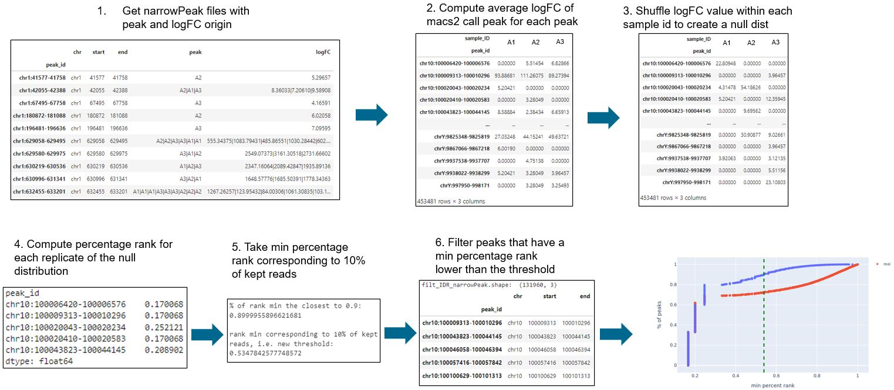
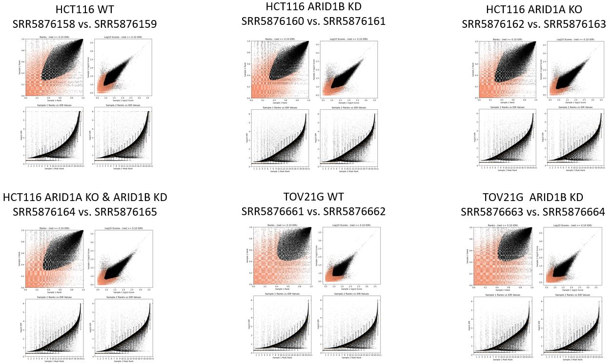
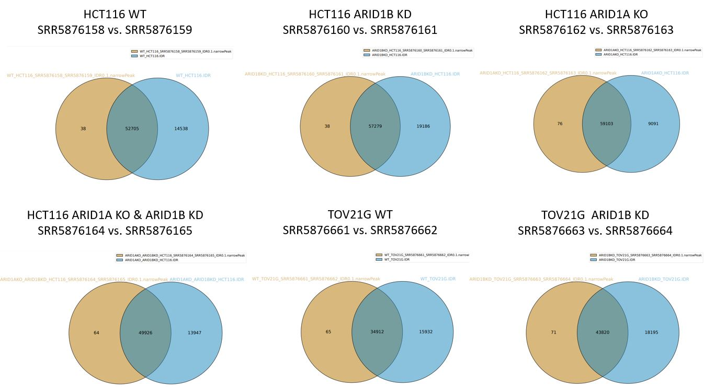

# Motivations

The Irreproducible Discovery Rate (IDR) is a method to combine combining replicates to only get the highly reproducible peaks and consistency between replicates in high-throughput experiments.  One way to assess concordance of peak calls between replicates is to implement a statistical procedure. A popular method is the IDR framework developed by Qunhua Li and Peter Bickel’s group. It compares a pair of ranked lists of regions/peaks and assigns values that reflect its reproducibility. The core IDR R package can be downloaded from the [IDR download page](http://cran.r-project.org/web/packages/idr/index.html).

This method can only compare a pair of repicates. When you have n replicates, you the have to compare $\binom{N}{2}$ pair of replicates. If N=4, you then have to compare by hand 6 pair of replicates. We propose another method to highlight the most significant peaks and consitency between replicates with all the replicates at once. 

# FHT-nIDR data flow

To illustrate the mechanism, we take a group of 3 replicates: A1, A2 and A3.  

**Step 1**: Combine and merge three replicates peak id, peak origin and logFC on the same narrowPeak file. For this step, we use bedtools merge to merge the peaks. In consequence, we can have several logFC from the same replicate.  
**Step 2**: Reformat bed file with a logFC per replicate and by peak id. If there is logFC from a replicate, the value is 0. When there are several logFC from the same replicates, we compute the average between them.  
**Step 3**: Generate a shuffled distribution of the logFC over the given list of peak ID for each replicate. 
**Step 4**: Compute the min percent rank of the shuffled distribution for each peak over the three replicates. In other words, we compute the percent rank of each replicates, i.e., we have three percent rank for each replicate. Then we only keep the minimum of the percent rank for each peak id.  
**Step 5**: Compute the ECDF and select the min percentage rank that corresponds to keeping above 90% of the reads.  In this example, the min percent rank is around 0.53.  
**Step 6**: Filter all peak id that have a min percent rank lower than the selected threshold from the null distribution.  
**Step 7**: Plot the ECDF of the min percent rank of the true logFC (red) and the null distribution (blue) with the threshold (green) to compare them. We expect to to see the null distribution above the real one and the threshold around where they have the biggest discreapancy.  

# Example 1

### Data
The standard pipeline was run on publicly available data from paper "[Chromatin accessibility underlies synthetic lethality of SWI/SNF subunits in ARID1A-mutant cancers](https://elifesciences.org/articles/30506#content)" looking for potential PD markers as well as what an ATAC-seq profile looks like. This paper has ATACseq results of ARID1A-/- cancer cell lines (native or CRISPR knockout) with ARID1B knockdown. 

**Data from GEO series**:  [link](https://www.ncbi.nlm.nih.gov/geo/query/acc.cgi?acc=GSE101975)

Overview of experiment:
* Biological context (N=2):  TOV21G, HCT116
* wild type and modified with stable ARID1A knockout
* Perturbagens (N=1):  shRNA knockdown of ARID1B
* Negative control (N=1):  wild type / untreated
* Replicates:  N=2

### HCT116 (ACH-000971)
* WT: SRR5876158 & SRR5876159
* ARID1B knockdown: SRR5876160 & SRR5876161
* ARID1A knockout: SRR5876162 & SRR5876163
* ARID1A knockout ARID1B knockdown:SRR5876164 & SRR5876165

### TOV21G (ACH-000885)
* WT: SRR5876661 & SRR5876662
* ARID1B knockdown: SRR5876663 & SRR5876664

In this example, there are only two replicates by group. Therefore, there are only $\binom{N}{2} = 1 $ comparison by group. This data is a good example to first verify that the peaks from the nIDR computation overlap with the standard method. First of all, the output from the standard IDR show that the replicates have high consitency betwen groups.
 

Then, the standard IDR narrowPeak file and the nIDR narrowPeak file have a great overlapp:

# Example 2

### Data

In this example, we compare some samples from random data with 3 replicates by group. 

# Example 3

### Data

In this example, we compare some samples from random data with 3 replicates by group with 

