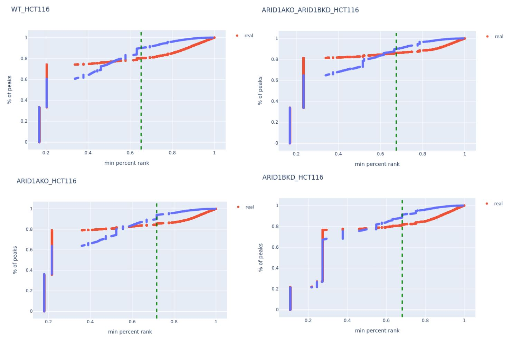
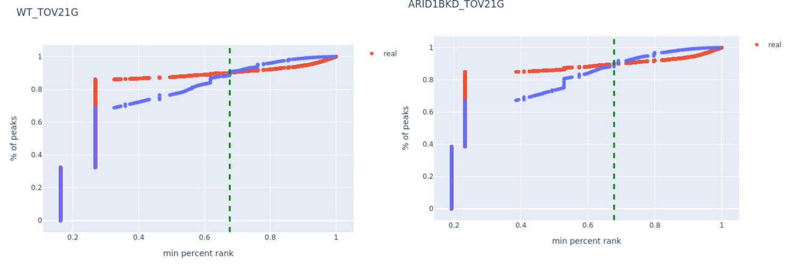
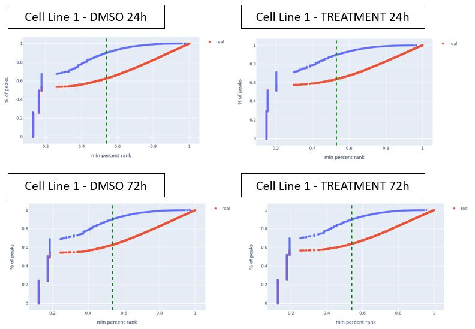
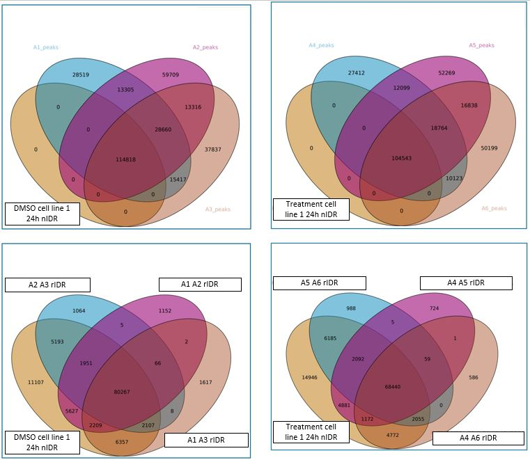
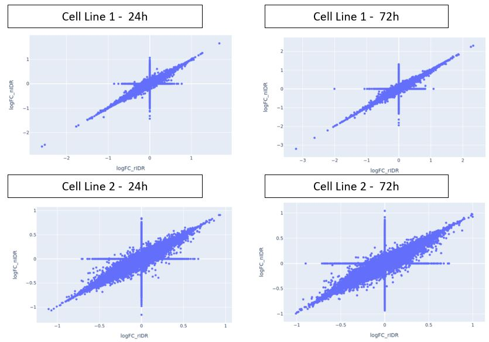
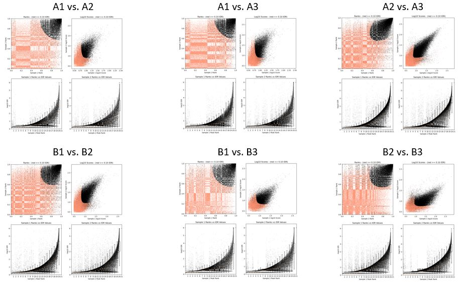
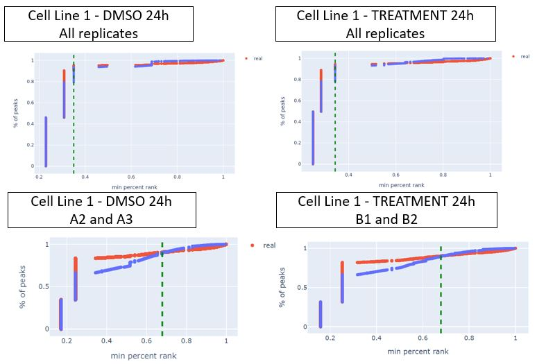
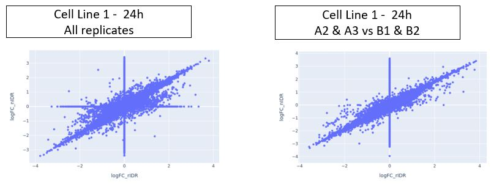

# Motivations

The Irreproducible Discovery Rate (IDR) is a method to identify highly reproducible results between replicates in high-throughput experiments, recommended for use by the [ENCODE consortium](https://www.encodeproject.org/software/idr/) and others. It is used to measure the consistency of results (such as the identification of transcription factor binding sites, histone marks, or gene expression levels) across experimental replicates. The standard method involves comparing the rank of results across different replicates to estimate the proportion of findings that are reproducible (consistent across replicates) versus those that are irreproducible (inconsistent or likely to be noise).  The method is described in [IDR framework developed by Qunhua Li and Peter Bickel’s group](https://projecteuclid.org/journals/annals-of-applied-statistics/volume-5/issue-3/Measuring-reproducibility-of-high-throughput-experiments/10.1214/11-AOAS466.full). Briefly, the method compares a pair of ranked lists of regions/peaks and assigns values that reflect its reproducibility. An implementation of the method can be downloaded from [bioconda](https://github.com/kundajelab/idr) as a Python package. This is the version we used prior to nIDR.

However, the above implementation can only compare a pair of replicates. When there are n>2 replicates, one method would be to use the above to do pairwise comparisons and choose the pair with the highest concordance.  However, that would require comparing $\binom{N}{2}$ pair of replicates. If N=4, that requires manual comparison of 6 pair of replicates.  In addition to the increased manual effort, it results in less statistical power that should be possible when using the full set of replicates simultaneously to identify consistent peaks/regions.  We have developed an implementation that allows use of an arbitrary number of replicates to identify peaks/regions that are consistent accross all replicates. We call it nIDR where n indicates it is for arbitrary <ins>n</ins>umber of replicates.

# Mathematical derivation of the new algorithm

Starting from equation (2.1) in Li et al (referenced above):

$$\psi(t) = \frac{1}{N} \sum_{i=1}^{N}{1 \left( X1_i>x_{X1}(t), X2_i>x_{X2}(t) \right) } $$

* $N$ number of features i.e. peaks
* $1(...)$ is an [indicator function](https://en.wikipedia.org/wiki/Indicator_function) that returns $1$ if all the arguments are true otherwise returns 0
* $X1_i$ values observed in replicate X1 for $i$ th feature
* $X2_i$ values observed in replicate X2 for $i$ th feature
* $t$ is the fractional rank i.e. number from 0 to 1
* $x_{X1}(t)$ percentile value of replicate X1.  i.e. $x_{X1}(0.5)$ is the 50th percentile aka median of the data for replicate X1
* $x_{X2}(t)$ percentile value of replicate X2.  i.e. $x_{X2}(0.5)$ is the 50th percentile aka median of the data for replicate X2

To help us understand how this works we use this illustrative example for $t=0.5$ .  Define:

* $median_{X1} = x_{X1}(t=0.5)$ the median of the data measured for replicate X1
* $median_{X2} = x_{X2}(t=0.5)$ the median of the data measured for replicate X2

then:

$$\psi(t=0.5) = \frac{1}{N} \sum_{i=1}^{N}{1 \left( X1_i>median_{X1},X2_i>median_{X2} \right) } $$

Restating the above:  the indicator function $1(...)$ is 1 if for feature $i$ the value for replicate $X1_i$ is greater than the median of $X1$ ($X1_i > median_{X1}$) and the value for replicate $X2_i$ is greater than the median for $X2_i$ ($X2_i > median_{X2}$), otherwise it is 0.  Therefore, $\psi(t=0.5)$ counts up the features where both $X1$ and $X2$ have values greater than their respective medians.

With the above understanding, we can do some mathematical rearrangements to develop an algorithm that allows us to more easily extend this to multiple replicates.  Note that Li et al also address this in section 4 of their supplemental "Extension of our model to the case of m > 2"; our goal here is rearrange for our understanding and to make reasonably efficient computer code.

define $frac\textunderscore rank\textunderscore X1$ as the fractional rank of $X1$ - a vector where each entry is the fractional rank of the corresponding $i$ th value in X1

$$frac\textunderscore rank\textunderscore X1_i = \frac{index\textunderscore of\textunderscore sorted\textunderscore X1(i)}{N}$$

Then:

$$ X1_i>x_{X1}(t) = frac\textunderscore rank\textunderscore X1_i>t $$

The equation for $\psi$ can be rewritten as:

$$\psi(t) = \frac{1}{N} \sum_{i=1}^{N}{1(frac\textunderscore rank\textunderscore X1_i>t, frac\textunderscore rank\textunderscore X2_i>t)} $$

The indicator function $1(...)$ and its arguments can be rewritten as:
  
$$1\Bigl(min[frac\textunderscore rank\textunderscore X1, frac\textunderscore rank\textunderscore X2]>t\Bigr)$$

yielding:

$$\psi(t) = \frac{1}{N} \sum_{i=1}^{N}{1 \Bigl(min(frac\textunderscore rank\textunderscore X1_i,frac\textunderscore rank\textunderscore X2_i)>t \Bigr)} $$

With the above, instead of calcuating the sum for each value of $t$ we can generate an ECDF (empirical cumulative distribution) of the above  To do that, we first, create the vector of values $min\textunderscore rank$ such that:

$$min\textunderscore rank_i = min(frac\textunderscore rank\textunderscore X1_i, frac\textunderscore rank\textunderscore X2_i))$$

Sort the above to create $sort\textunderscore min\textunderscore rank$ such that:

$$sort\textunderscore min\textunderscore rank_i <= sort\textunderscore min\textunderscore rank_{i+1}$$

starting at beginning of vector $sort\textunderscore min\textunderscore rank$, find $sort\textunderscore min\textunderscore rank\textunderscore index(t)$ which is first occurrence of $t$ in $sort\textunderscore min\textunderscore rank$

$$sort\textunderscore min\textunderscore rank\bigl[sort\textunderscore min\textunderscore rank\textunderscore index(t)\bigr] = t$$

Now we have the ECDF of the $min\textunderscore rank$ which is equivalent to:

$$\psi(t) = \frac{sort\textunderscore min\textunderscore rank\textunderscore index(t)}{N}$$

The above procedure and equation then leads to a fairly straightforward algorithm to implement:
1. calculate the fractional rank of values within each replicate
2. For each feature in the replicates, calculate the minimum fractional rank
3. calculate an ECDF of these minimum fractional ranks - this is now $psi(t)$
This methodology has allowed us to extend IDR to arbitrary numbers of replicates, and to extend the number of features into the hundreds of millions (and we expect billions).

# FHT-nIDR data flow

We illustrate nIDR via practical use on ATAC-seq data, using a group of 3 replicates: A1, A2 and A3, where the ATAC-seq peaks correspond to the individual features $i$ described above.  We are using the output of peak calling (using macs2) on the individual replicates which generates a set of peaks, their signal strength and statistical significance (above background) as contained the `narrowPeak` file that is output from macs2.  See our [ATAC-seq pipeline](https://github.com/FoghornTherapeutics/FHT-ATACseq-pipeline) for more information.

Here is a walkthrough of the calculation, with example tables/plots for each step below:

**Step 1**: Combine and merge three replicates peak id, peak origin and logFC on the same narrowPeak file. For this step, we use bedtools merge to merge the peaks. In consequence, there can be a many-to-many relationship between peaks in the replicates, and hence more than one logFC value from each replicate.  
**Step 2**: Aggregate multiple values per peak for a single replicate in merged bed file.  In other words, when there are several logFC from the same replicate for one peak, we compute the average logFC value.  If there is no peak for one of the replicates, the logFC value is set to 0  
**Step 3**: Generate a an empirical null distribution by randomly shuffling the logFC values within each replicate. 
**Step 4**: Compute the min percent rank of the shuffled distribution for each peak over the three replicates. In other words, we compute the percent rank of each replicates, i.e., we have three percent rank for each replicate. Then we only keep the minimum of the percent rank for each peak id.  
**Step 5**: Compute the ECDF and select the min percentage rank that corresponds to keeping above 90% of the reads.  In this example, the min percent rank is around 0.53.  
**Step 6**: Only keep peaks that have a min percent rank higher than the selected threshold from the null distribution.  
**Step 7**: Generate Empirical Cumulative Distribution Function (ECDF) plot of the min percent rank (aka consistency across replicates) of all peaks found in the group of replicates - lower right graph below.. The x-axis is the "min percent rank" which indicates the consistency of a peak across the replicates - a higher value corresponds to a higher consistency of a peak accross the replicates. The y-axis is the fraction peaks that have at least that value. The red curve is plotting the data and the blue curve is the empirical null distribution. The green dashed line indicates a p-value of 0.1 based on the blue null curve and determines the threshold of min percent rank aka consistency score to use for keeping the peaks whose consistency value has a p-value <= 0.1. In this case, the green dashed line indicates the threshold is a min percent rank of 0.53.  As a further QC check, the null distribution is above the true values, meaning that replicates of the same group show more consistency than the empirical null.

# Example 1

### Data
Our standard [ATAC-seq pipeline](https://github.com/FoghornTherapeutics/FHT-ATACseq-pipeline) was run on publicly available data from paper "[Chromatin accessibility underlies synthetic lethality of SWI/SNF subunits in ARID1A-mutant cancers](https://elifesciences.org/articles/30506#content)" to generate the example peak calling data used as inputs in this example use of nIDR. This paper has ATACseq results of ARID1A-/- cancer cell lines (native or CRISPR knockout) with ARID1B knockdown. 

**Data from GEO series**:  [link](https://www.ncbi.nlm.nih.gov/geo/query/acc.cgi?acc=GSE101975)

Overview of experiment:
* Biological context (N=2):  TOV21G, HCT116
* wild type and modified with stable ARID1A knockout
* Perturbagens (N=1):  shRNA knockdown of ARID1B
* Negative control (N=1):  wild type / untreated
* Replicates:  N=2

#### HCT116 (ACH-000971)
* WT: SRR5876158 & SRR5876159
* ARID1B knockdown: SRR5876160 & SRR5876161
* ARID1A knockout: SRR5876162 & SRR5876163
* ARID1A knockout ARID1B knockdown:SRR5876164 & SRR5876165

#### TOV21G (ACH-000885)
* WT: SRR5876661 & SRR5876662
* ARID1B knockdown: SRR5876663 & SRR5876664

### Results

In this example, there are only two replicates by group. Therefore, there are only $\binom{N}{2} = \binom{2}{2}= 1$ comparison by group. This data is a good example to first verify that the peaks from the nIDR computation overlap with previous implementations. 

As part of the output of the regular IDR analysis, a corresponding image file is generated for each pair of replicates, containing four plots. The last two (bottom row), represents the reproducibility of peaks comparing the peak rank versus IDR scores. The overlaid boxplots illustrate the distribution of IDR values within each 10% quantile. By default, the IDR values are thresholded at the optimization precision of 1e-6, ensuring a refined and precise selection of peaks. Pairs with tighter, steeper curves are preferable.

The results from nIDR also show consistency between the replicates - the ECDF of the data is substantially higher than the ECDF of the empirical null distribution. 

For a direct comparison of the IDR implementations, we compare the overlap in peaks selected between the regular IDR narrowPeak and our method nIDR. To remind ourselves, the IDR algorithm involves several key steps to enhance the reliability of peak calling by assessing reproducibility across experimental replicates. Initially, the algorithm separates peaks into two groups by sampling from both signal and noise distributions, aiming to distinguish genuine peaks from background noise. Peaks are then ranked based on signal strength and consistency, and a chosen p-value cutoff helps identify statistically significant peaks. In our case, we use the `--soft-idr-threshold` parameter equal to 0.1, providing flexibility in the identification of peaks that may exhibit slight variations across replicates. Finally, the algorithm requires the narrowPeak files to be sorted based on the -log10(p-value) column for further analysis and interpretation.

We illustrate this comparison using Venn diagrams below. The result is that nIDR is effectively a superset of the earlier implementation of IDR, with less than 0.2% of peaks from the original IDR not present in the peaks identified by nIDR.  The higher number of peaks found by nIDR is due to the choice of p-value threshold chosen above and of course can be reduced by choosing a high stringency.  This difference is also partly due to the difference in how the p-value is calculated i.e. using the empirical null distribution which is not used in the previous implementation.

# Example 2

### Data

In this example, we compare some samples from random data with 3 replicates by group. Therefore, there are only $\binom{N}{2} = \binom{3}{2} = 3$ comparison by group.

Overview of experiment:
* Biological context (N=2): Cell line 1
* Perturbagens (N=1): treatment
* Time point (N=2): 24h and 72h
* Negative control (N=1): wild type / untreated
* Replicates: N=3

The ECDF shows the null distribution above the true values with a substantial gap, indicating that replicates of the same group show more consistency and than the null distribution. The green dashed line indicates the threshold where 90% of the null peaks have a consistency score below 0.53, indicating our threshold for choosing peaks with p-value < 0.1.

We compare the overlap of peaks between the nIDR, the individual samples for the replicates at 24h, and a comparison between nIDR peaks and pairwise previous IDR. The first row is Venn Diagrams comparing nIDR to individual samples, the left figure is for DMSO and the right is for treatment. As expected / by definition, the nIDR peaks are a subset of the peaks in the individual samples.  This also illustrates the high degree of correlation between the samples, as most of their peaks overlap as well.  However to be clear the simple overlap of peaks based on genomic location does not confer any information on the consistency of the intensity above background of these peaks, and therefore does not provide enough information to choose consistent peaks. 

The second row in the figure compares the  nIDR narrowPeak and each of the pairwise regular IDR narrowPeak. We can see that each pairwise regular IDR has good overlap with each other, but also with the results of nIDR.  We also note that nIDR has additional peaks not found in any pairwise IDR analysis; this can be do to our different method of null distribution (described above) but also due to the ability of nIDR to capture more intermediate strength peaks that are consistent across all 3 replicates that would be missed in a pairwise analysis

As a further comparison, we compare the [Differential Peak Area (DPA) ](https://github.com/FoghornTherapeutics/FHT-ATACseq-pipeline/blob/main/README.md#2-differential-peak-area-dpa) using the regular IDR narrowPeak and our method nIDR, the DPA logFC are overall well correlated. This scatter plot compares the DPA logFC from the regular IDR on the x-axis and from the nIDR on the y-axis for each contrast (DMSO vs treatment) at 24h and 72h. 

# Example 3: Groups with outlier(s)

### Data

One of the challenge of this method is to compare all N replicates of a group regardless of their consistency. However, in the ATACseq pipeline described [here](https://github.com/FoghornTherapeutics/FHT-ATACseq-pipeline/blob/main/README.md), we first compute a series of QC measures (multiqc, FRiP, PCA, sample correlations) to identify any potential outliers in a group of replicates. You can find an example of a QC result that identifies an outlier [here](https://github.com/FoghornTherapeutics/FHT-ATACseq-pipeline/blob/main/QC_example_with_outlier.md).  

This next example investigates the nIDR method on a set of replicates one of which has poor QC and is not well correlated with the others. 

Overview of experiment:
* Biological context (N=1): Cell line 1
* Perturbagens (N=1): treatment
* Time point (N=1): 24h 
* Negative control (N=1): wild type / untreated
* Replicates: N=3

Samples A1, A2 and A3 are for the negative control. A1 was identified as an outlier (low FRiP scores, did not cluster with any other replicates in PCA plot and lower sample-to-sample correlation).
Samples B1, B2 and B3 are for the negative control. B3 was also identified as an outlier (lower insret size, did not cluster with any other replicates in PCA plot and lower sample-to-sample correlation).

#### Negative control group:

First, we compare the standard output from the regular IDR, we can see that the boxplot curve between A2 and A3 is much steeper, indicating that A2 and A3 have more consistency than A1. It is less obvious for the negative control group but the comparison between B1 and B2 boxplot curve is slightly steeper.

We apply the nIDR method on all three replicates in both groups (first row of figure below). A first striking observation compared to previous examples is that there is no longer a substantial gap between the ECDF of the real data and the null distribution, indicating that the consistency of the real data is not much better than if you randomly shuffled the peaks.   

We then apply nIDR removing the outlier samples (second row of figure below). Although the ECDF of the real data is still close to the empirical null distribution, it is lower, indicating an improvement in the consistency of the peaks when only using the 2 consistent replicates.

Finally, we compare the logFC of the differential peak area (DPA) for nIDR and regular IDR, for the case of using all three replicates, or just keeping 2 replicates.  As expected, there is better correlation between the results after removing the outlier replicates.

